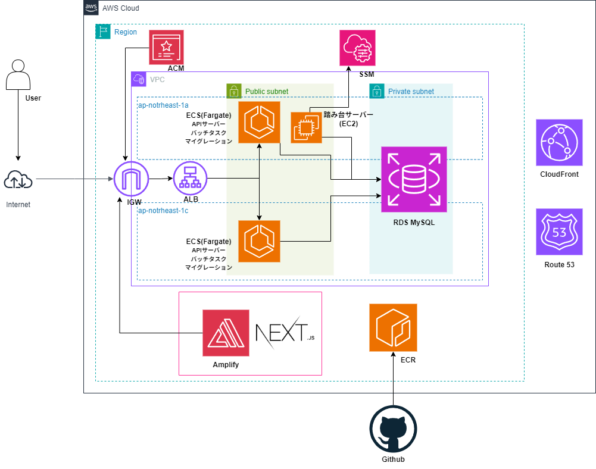

# このリポジトリについて

京都工芸繊維大学の学生を対象とした奨学金一覧へのアクセスを便利にした Web アプリ「[KIT クレクレ奨学金](https://www.kit-gimme-scholarship.com/)」のバックエンドのリポジトリです．

**フロントエンド**: https://github.com/acu4git/gimme-scholarship-front/ 
**インフラ**: https://github.com/acu4git/gimme-scholarship-terraform/

## 開発環境

- Ubuntu 22.04.5 (WSL2)
- Go 1.24
- Python 3.12.0
- MySQL 8.0
- Docker version 28.2.2
- tbls 1.84.0
- sql-migrate v1.7.1

## クラウド

AWS を採用しました．リソースが豊富であり，今回実装するアプリケーションに必要なリソースを組み合わせることが容易であったためです．

**アーキテクチャ図**

## 機能

### api

このリポジトリのメインとなる部分です．ユーザー登録や奨学金検索，その他 API の責務を果たします．Web API として用意することでネイティブアプリを実装する際にも使えるようにしています．

### migrate

文字通り DB へのマイグレーションを行います．migration ディレクトリ配下にあるファイルを読み込ませることで，テーブルやカラムの作成・修正します．コンテナ化して ECS で稼働させる

### fetch

奨学金一覧情報を取得して DB の更新を行います．毎日 AM10:00(JTC)にバッチタスクとして起動します．
