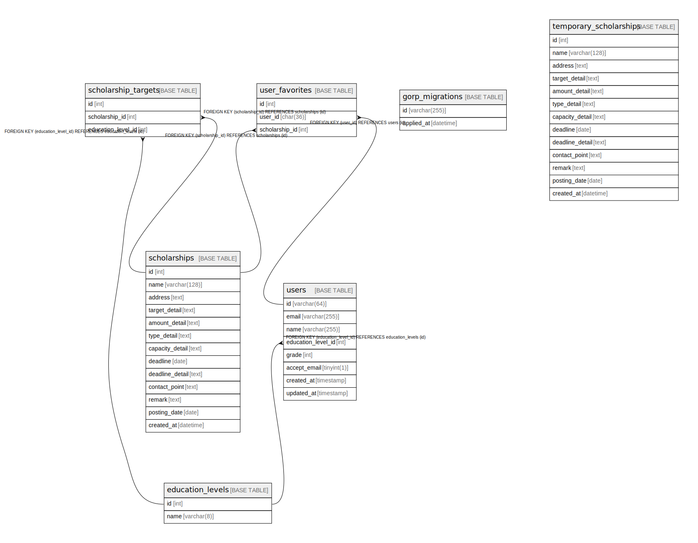

# gimme_scholarship

## Tables

| Name | Columns | Comment | Type |
| ---- | ------- | ------- | ---- |
| [education_levels](education_levels.md) | 2 |  | BASE TABLE |
| [gorp_migrations](gorp_migrations.md) | 2 |  | BASE TABLE |
| [magic_links](magic_links.md) | 7 |  | BASE TABLE |
| [scholarship_target](scholarship_target.md) | 3 |  | BASE TABLE |
| [scholarships](scholarships.md) | 13 |  | BASE TABLE |
| [temporary_scholarships](temporary_scholarships.md) | 13 |  | BASE TABLE |
| [user_favorite](user_favorite.md) | 3 |  | BASE TABLE |
| [users](users.md) | 6 |  | BASE TABLE |

## Relations

---

> Generated by [tbls](https://github.com/k1LoW/tbls)
