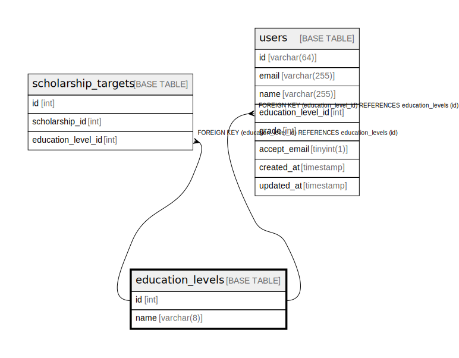

# education_levels

## Description

<details>
<summary><strong>Table Definition</strong></summary>

```sql
CREATE TABLE `education_levels` (
  `id` int NOT NULL AUTO_INCREMENT,
  `name` varchar(8) COLLATE utf8mb4_unicode_ci DEFAULT NULL COMMENT '学部や院などの情報',
  PRIMARY KEY (`id`)
) ENGINE=InnoDB DEFAULT CHARSET=utf8mb4 COLLATE=utf8mb4_unicode_ci
```

</details>

## Columns

| Name | Type | Default | Nullable | Extra Definition | Children | Parents | Comment |
| ---- | ---- | ------- | -------- | ---------------- | -------- | ------- | ------- |
| id | int |  | false | auto_increment | [scholarship_target](scholarship_target.md) [users](users.md) |  |  |
| name | varchar(8) |  | true |  |  |  | 学部や院などの情報 |

## Constraints

| Name | Type | Definition |
| ---- | ---- | ---------- |
| PRIMARY | PRIMARY KEY | PRIMARY KEY (id) |

## Indexes

| Name | Definition |
| ---- | ---------- |
| PRIMARY | PRIMARY KEY (id) USING BTREE |

## Relations



---

> Generated by [tbls](https://github.com/k1LoW/tbls)
