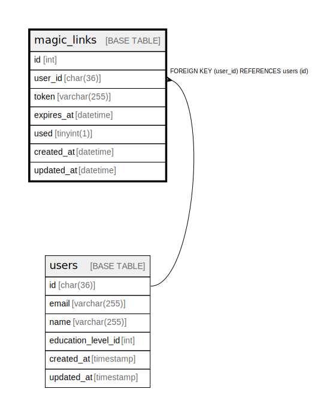

# magic_links

## Description

<details>
<summary><strong>Table Definition</strong></summary>

```sql
CREATE TABLE `magic_links` (
  `id` int NOT NULL AUTO_INCREMENT,
  `user_id` char(36) COLLATE utf8mb4_unicode_ci NOT NULL,
  `token` varchar(255) COLLATE utf8mb4_unicode_ci NOT NULL,
  `expires_at` datetime NOT NULL,
  `used` tinyint(1) NOT NULL DEFAULT '0',
  `created_at` datetime DEFAULT CURRENT_TIMESTAMP,
  `updated_at` datetime DEFAULT CURRENT_TIMESTAMP ON UPDATE CURRENT_TIMESTAMP,
  PRIMARY KEY (`id`),
  UNIQUE KEY `token` (`token`),
  KEY `magic_links_user_id` (`user_id`),
  CONSTRAINT `magic_links_user_id` FOREIGN KEY (`user_id`) REFERENCES `users` (`id`) ON DELETE CASCADE
) ENGINE=InnoDB DEFAULT CHARSET=utf8mb4 COLLATE=utf8mb4_unicode_ci
```

</details>

## Columns

| Name | Type | Default | Nullable | Extra Definition | Children | Parents | Comment |
| ---- | ---- | ------- | -------- | ---------------- | -------- | ------- | ------- |
| id | int |  | false | auto_increment |  |  |  |
| user_id | char(36) |  | false |  |  | [users](users.md) |  |
| token | varchar(255) |  | false |  |  |  |  |
| expires_at | datetime |  | false |  |  |  |  |
| used | tinyint(1) | 0 | false |  |  |  |  |
| created_at | datetime | CURRENT_TIMESTAMP | true | DEFAULT_GENERATED |  |  |  |
| updated_at | datetime | CURRENT_TIMESTAMP | true | DEFAULT_GENERATED on update CURRENT_TIMESTAMP |  |  |  |

## Constraints

| Name | Type | Definition |
| ---- | ---- | ---------- |
| magic_links_user_id | FOREIGN KEY | FOREIGN KEY (user_id) REFERENCES users (id) |
| PRIMARY | PRIMARY KEY | PRIMARY KEY (id) |
| token | UNIQUE | UNIQUE KEY token (token) |

## Indexes

| Name | Definition |
| ---- | ---------- |
| magic_links_user_id | KEY magic_links_user_id (user_id) USING BTREE |
| PRIMARY | PRIMARY KEY (id) USING BTREE |
| token | UNIQUE KEY token (token) USING BTREE |

## Relations



---

> Generated by [tbls](https://github.com/k1LoW/tbls)
