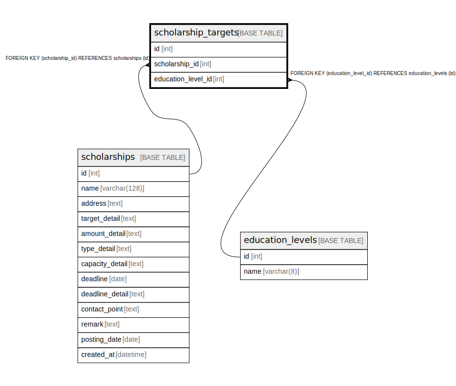

# scholarship_targets

## Description

<details>
<summary><strong>Table Definition</strong></summary>

```sql
CREATE TABLE `scholarship_targets` (
  `id` int NOT NULL AUTO_INCREMENT,
  `scholarship_id` int NOT NULL,
  `education_level_id` int NOT NULL,
  PRIMARY KEY (`id`),
  UNIQUE KEY `scholarship_id` (`scholarship_id`,`education_level_id`),
  KEY `scholarship_target_education_level_id` (`education_level_id`),
  CONSTRAINT `fk_scholarship_id` FOREIGN KEY (`scholarship_id`) REFERENCES `scholarships` (`id`) ON DELETE CASCADE,
  CONSTRAINT `scholarship_target_education_level_id` FOREIGN KEY (`education_level_id`) REFERENCES `education_levels` (`id`) ON DELETE RESTRICT
) ENGINE=InnoDB DEFAULT CHARSET=utf8mb4 COLLATE=utf8mb4_unicode_ci
```

</details>

## Columns

| Name | Type | Default | Nullable | Extra Definition | Children | Parents | Comment |
| ---- | ---- | ------- | -------- | ---------------- | -------- | ------- | ------- |
| id | int |  | false | auto_increment |  |  |  |
| scholarship_id | int |  | false |  |  | [scholarships](scholarships.md) |  |
| education_level_id | int |  | false |  |  | [education_levels](education_levels.md) |  |

## Constraints

| Name | Type | Definition |
| ---- | ---- | ---------- |
| fk_scholarship_id | FOREIGN KEY | FOREIGN KEY (scholarship_id) REFERENCES scholarships (id) |
| PRIMARY | PRIMARY KEY | PRIMARY KEY (id) |
| scholarship_id | UNIQUE | UNIQUE KEY scholarship_id (scholarship_id, education_level_id) |
| scholarship_target_education_level_id | FOREIGN KEY | FOREIGN KEY (education_level_id) REFERENCES education_levels (id) |

## Indexes

| Name | Definition |
| ---- | ---------- |
| scholarship_target_education_level_id | KEY scholarship_target_education_level_id (education_level_id) USING BTREE |
| PRIMARY | PRIMARY KEY (id) USING BTREE |
| scholarship_id | UNIQUE KEY scholarship_id (scholarship_id, education_level_id) USING BTREE |

## Relations



---

> Generated by [tbls](https://github.com/k1LoW/tbls)
