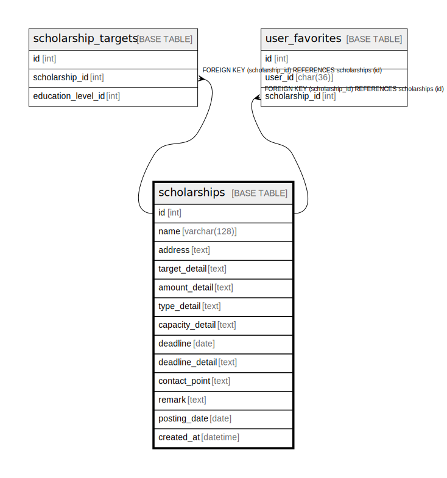

# scholarships

## Description

<details>
<summary><strong>Table Definition</strong></summary>

```sql
CREATE TABLE `scholarships` (
  `id` int NOT NULL AUTO_INCREMENT,
  `name` varchar(128) COLLATE utf8mb4_unicode_ci NOT NULL,
  `address` varchar(255) COLLATE utf8mb4_unicode_ci NOT NULL,
  `target_detail` varchar(255) COLLATE utf8mb4_unicode_ci NOT NULL,
  `amount_detail` varchar(128) COLLATE utf8mb4_unicode_ci NOT NULL,
  `type_detail` varchar(128) COLLATE utf8mb4_unicode_ci NOT NULL,
  `capacity_detail` varchar(128) COLLATE utf8mb4_unicode_ci NOT NULL,
  `deadline` date NOT NULL,
  `deadline_detail` varchar(128) COLLATE utf8mb4_unicode_ci NOT NULL,
  `contact_point` varchar(128) COLLATE utf8mb4_unicode_ci NOT NULL,
  `remark` varchar(128) COLLATE utf8mb4_unicode_ci NOT NULL DEFAULT '',
  `posting_date` date NOT NULL,
  `created_at` timestamp NOT NULL DEFAULT CURRENT_TIMESTAMP,
  PRIMARY KEY (`id`),
  UNIQUE KEY `name` (`name`)
) ENGINE=InnoDB DEFAULT CHARSET=utf8mb4 COLLATE=utf8mb4_unicode_ci
```

</details>

## Columns

| Name | Type | Default | Nullable | Extra Definition | Children | Parents | Comment |
| ---- | ---- | ------- | -------- | ---------------- | -------- | ------- | ------- |
| id | int |  | false | auto_increment | [scholarship_target](scholarship_target.md) |  |  |
| name | varchar(128) |  | false |  |  |  |  |
| address | varchar(255) |  | false |  |  |  |  |
| target_detail | varchar(255) |  | false |  |  |  |  |
| amount_detail | varchar(128) |  | false |  |  |  |  |
| type_detail | varchar(128) |  | false |  |  |  |  |
| capacity_detail | varchar(128) |  | false |  |  |  |  |
| deadline | date |  | false |  |  |  |  |
| deadline_detail | varchar(128) |  | false |  |  |  |  |
| contact_point | varchar(128) |  | false |  |  |  |  |
| remark | varchar(128) |  | false |  |  |  |  |
| posting_date | date |  | false |  |  |  |  |
| created_at | timestamp | CURRENT_TIMESTAMP | false | DEFAULT_GENERATED |  |  |  |

## Constraints

| Name | Type | Definition |
| ---- | ---- | ---------- |
| name | UNIQUE | UNIQUE KEY name (name) |
| PRIMARY | PRIMARY KEY | PRIMARY KEY (id) |

## Indexes

| Name | Definition |
| ---- | ---------- |
| PRIMARY | PRIMARY KEY (id) USING BTREE |
| name | UNIQUE KEY name (name) USING BTREE |

## Relations



---

> Generated by [tbls](https://github.com/k1LoW/tbls)
