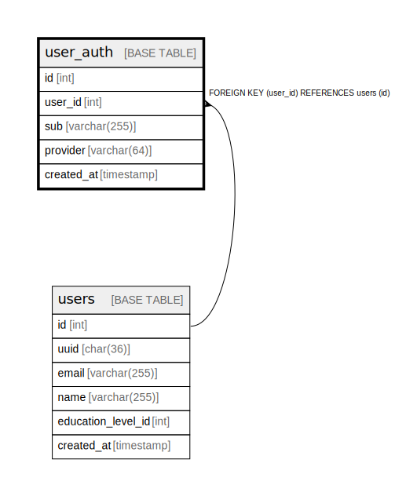

# user_auth

## Description

<details>
<summary><strong>Table Definition</strong></summary>

```sql
CREATE TABLE `user_auth` (
  `id` int NOT NULL AUTO_INCREMENT,
  `user_id` int NOT NULL,
  `sub` varchar(255) COLLATE utf8mb4_unicode_ci NOT NULL,
  `provider` varchar(64) COLLATE utf8mb4_unicode_ci NOT NULL,
  `created_at` timestamp NOT NULL DEFAULT CURRENT_TIMESTAMP,
  PRIMARY KEY (`id`),
  UNIQUE KEY `unique_sub_provider` (`sub`,`provider`),
  KEY `fk_user_id` (`user_id`),
  CONSTRAINT `fk_user_id` FOREIGN KEY (`user_id`) REFERENCES `users` (`id`)
) ENGINE=InnoDB DEFAULT CHARSET=utf8mb4 COLLATE=utf8mb4_unicode_ci
```

</details>

## Columns

| Name | Type | Default | Nullable | Extra Definition | Children | Parents | Comment |
| ---- | ---- | ------- | -------- | ---------------- | -------- | ------- | ------- |
| id | int |  | false | auto_increment |  |  |  |
| user_id | int |  | false |  |  | [users](users.md) |  |
| sub | varchar(255) |  | false |  |  |  |  |
| provider | varchar(64) |  | false |  |  |  |  |
| created_at | timestamp | CURRENT_TIMESTAMP | false | DEFAULT_GENERATED |  |  |  |

## Constraints

| Name | Type | Definition |
| ---- | ---- | ---------- |
| fk_user_id | FOREIGN KEY | FOREIGN KEY (user_id) REFERENCES users (id) |
| PRIMARY | PRIMARY KEY | PRIMARY KEY (id) |
| unique_sub_provider | UNIQUE | UNIQUE KEY unique_sub_provider (sub, provider) |

## Indexes

| Name | Definition |
| ---- | ---------- |
| fk_user_id | KEY fk_user_id (user_id) USING BTREE |
| PRIMARY | PRIMARY KEY (id) USING BTREE |
| unique_sub_provider | UNIQUE KEY unique_sub_provider (sub, provider) USING BTREE |

## Relations



---

> Generated by [tbls](https://github.com/k1LoW/tbls)
