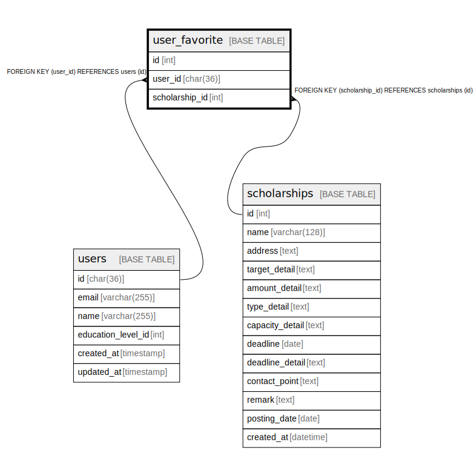

# user_favorite

## Description

<details>
<summary><strong>Table Definition</strong></summary>

```sql
CREATE TABLE `user_favorite` (
  `id` int NOT NULL AUTO_INCREMENT,
  `user_id` char(36) COLLATE utf8mb4_unicode_ci NOT NULL,
  `scholarship_id` int NOT NULL,
  PRIMARY KEY (`id`),
  UNIQUE KEY `user_id` (`user_id`,`scholarship_id`),
  KEY `user_favorite_scholarship_id` (`scholarship_id`),
  CONSTRAINT `user_favorite_scholarship_id` FOREIGN KEY (`scholarship_id`) REFERENCES `scholarships` (`id`) ON DELETE CASCADE,
  CONSTRAINT `user_favorite_user_id` FOREIGN KEY (`user_id`) REFERENCES `users` (`id`) ON DELETE CASCADE
) ENGINE=InnoDB DEFAULT CHARSET=utf8mb4 COLLATE=utf8mb4_unicode_ci
```

</details>

## Columns

| Name | Type | Default | Nullable | Extra Definition | Children | Parents | Comment |
| ---- | ---- | ------- | -------- | ---------------- | -------- | ------- | ------- |
| id | int |  | false | auto_increment |  |  |  |
| user_id | char(36) |  | false |  |  | [users](users.md) |  |
| scholarship_id | int |  | false |  |  | [scholarships](scholarships.md) |  |

## Constraints

| Name | Type | Definition |
| ---- | ---- | ---------- |
| PRIMARY | PRIMARY KEY | PRIMARY KEY (id) |
| user_favorite_scholarship_id | FOREIGN KEY | FOREIGN KEY (scholarship_id) REFERENCES scholarships (id) |
| user_favorite_user_id | FOREIGN KEY | FOREIGN KEY (user_id) REFERENCES users (id) |
| user_id | UNIQUE | UNIQUE KEY user_id (user_id, scholarship_id) |

## Indexes

| Name | Definition |
| ---- | ---------- |
| user_favorite_scholarship_id | KEY user_favorite_scholarship_id (scholarship_id) USING BTREE |
| PRIMARY | PRIMARY KEY (id) USING BTREE |
| user_id | UNIQUE KEY user_id (user_id, scholarship_id) USING BTREE |

## Relations



---

> Generated by [tbls](https://github.com/k1LoW/tbls)
