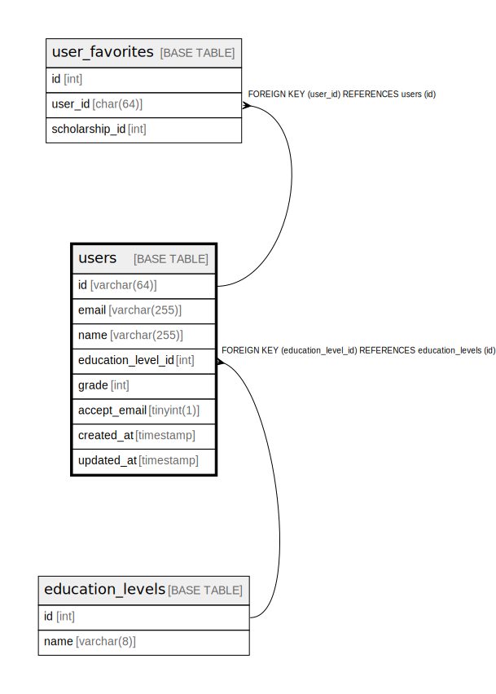

# users

## Description

<details>
<summary><strong>Table Definition</strong></summary>

```sql
CREATE TABLE `users` (
  `id` char(36) COLLATE utf8mb4_unicode_ci NOT NULL,
  `email` varchar(255) COLLATE utf8mb4_unicode_ci NOT NULL,
  `name` varchar(255) COLLATE utf8mb4_unicode_ci NOT NULL COMMENT '表示名',
  `education_level_id` int NOT NULL,
  `created_at` timestamp NOT NULL DEFAULT CURRENT_TIMESTAMP,
  `updated_at` timestamp NOT NULL DEFAULT CURRENT_TIMESTAMP ON UPDATE CURRENT_TIMESTAMP,
  PRIMARY KEY (`id`),
  UNIQUE KEY `email` (`email`),
  KEY `users_education_level_id` (`education_level_id`),
  CONSTRAINT `users_education_level_id` FOREIGN KEY (`education_level_id`) REFERENCES `education_levels` (`id`) ON DELETE RESTRICT
) ENGINE=InnoDB DEFAULT CHARSET=utf8mb4 COLLATE=utf8mb4_unicode_ci
```

</details>

## Columns

| Name | Type | Default | Nullable | Extra Definition | Children | Parents | Comment |
| ---- | ---- | ------- | -------- | ---------------- | -------- | ------- | ------- |
| id | char(36) |  | false |  | [magic_links](magic_links.md) [user_favorite](user_favorite.md) |  |  |
| email | varchar(255) |  | false |  |  |  |  |
| name | varchar(255) |  | false |  |  |  | 表示名 |
| education_level_id | int |  | false |  |  | [education_levels](education_levels.md) |  |
| created_at | timestamp | CURRENT_TIMESTAMP | false | DEFAULT_GENERATED |  |  |  |
| updated_at | timestamp | CURRENT_TIMESTAMP | false | DEFAULT_GENERATED on update CURRENT_TIMESTAMP |  |  |  |

## Constraints

| Name | Type | Definition |
| ---- | ---- | ---------- |
| email | UNIQUE | UNIQUE KEY email (email) |
| PRIMARY | PRIMARY KEY | PRIMARY KEY (id) |
| users_education_level_id | FOREIGN KEY | FOREIGN KEY (education_level_id) REFERENCES education_levels (id) |

## Indexes

| Name | Definition |
| ---- | ---------- |
| users_education_level_id | KEY users_education_level_id (education_level_id) USING BTREE |
| PRIMARY | PRIMARY KEY (id) USING BTREE |
| email | UNIQUE KEY email (email) USING BTREE |

## Relations



---

> Generated by [tbls](https://github.com/k1LoW/tbls)
